  

  <a href="https://karn8.github.io/karan-gupta-portfolio/">Portfolio</a>
  &nbsp;·&nbsp;
  <a href="https://www.linkedin.com/in/karangupta8">LinkedIn</a>
  &nbsp;·&nbsp;
  <a href="mailto:gupta.karanp@gmail.com">Email</a>
  &nbsp;·&nbsp;
  <a href="https://orbitlmsapp.com">Orbit LMS</a>

## The role I play

I work in the space between a business question and a working system. That can mean cleaning and modelling a large dataset, translating a workflow into software, building an analytics product, or explaining the result clearly enough for someone to act on it.

- 🎓 MSc Business Analytics at **The University of Manchester** — Merit; thesis work on low-hallucination LLM decision support for business risk reporting
- 🧪 Former Software Engineer Intern at **Honeywell Life Sciences** and **Tata Motors**
- 📍 Based in Manchester, with full work authorisation in India and open to relocation
- ⚽ Borussia Dortmund supporter; I like systems that create space, move information quickly, and make the next decision easier

## My formation

| `10 / INSIGHTS` | `8 / BUILD` | `6 / FOUNDATIONS` |
|---|---|---|
| Statistical modelling, forecasting, optimisation, Power BI and decision storytelling | Python, FastAPI, Flutter, Firebase, REST APIs and quality automation | SQL, PostgreSQL, data cleaning, validation, ETL and reproducible analysis |

## Selected work

| Project | What it does | Evidence |
|---|---|---|
| **OneCelerity** | Marketing intelligence SaaS that unifies Shopify and Meta Ads data into profit, ROAS, CPA, creative, regional and revenue insights, with a guardrailed AI analyst layer. | [Case study](https://karn8.github.io/karan-gupta-portfolio/#dossier) |
| **Orbit LMS** | Production Flutter/Firebase learning platform with role-based workflows, linked profiles, notifications and academic analytics. | [Website](https://orbitlmsapp.com) |
| **International Coal Optimisation** | Scenario model for fuel selection, emissions constraints, carbon-price sensitivity and SO₂-control investment decisions; achieved 40%+ emissions reduction in strict scenarios. | [Live app](https://international-coal.streamlit.app/) |
| **StaffSync** | Hospital A&E staffing and analytics prototype for demand patterns, operational constraints and resource-allocation scenarios. | [Live app](https://staffsync.streamlit.app/) |

## Experience, measured

**Honeywell Life Sciences · Software Engineer Intern**

- Developed an AI-assisted APQR compliance workflow using NLP, classification, LLM suggestions, time-series analysis and a Python/FastAPI service.
- Automated 20+ UI/API regression tests, saving approximately 10 hours of manual QA per cycle and increasing test coverage by approximately 10%.

**Tata Motors · Software Engineer Intern**

- Replaced outsourced vehicle-testbed data conversion with an in-house Python ETL workflow, saving approximately **₹7.8 lakh per month**.
- Standardised and scheduled approximately **2,300 files per week**, reducing turnaround from 3 hours to approximately 2 minutes.

## Research at scale

My published sentiment-rating research used a large corpus of user reviews spanning Coursera courses. The work covered the full text-data pipeline: collection, cleaning, tokenisation, normalisation and standardisation, followed by TextBlob/VADER sentiment modelling and systematic evaluation of sentiment-to-rating scaling methods. The final model achieved **98% accuracy**.

→ [Read the publication](https://ijirt.org/article?manuscript=164257)

## Tools in the squad

  

`Power BI` · `Excel` · `SQL` · `Pandas` · `NumPy` · `scikit-learn` · `Selenium` · `REST Assured` · `Postman` · `Jira`

---

  <strong>Interested in analytics, decision systems, and software that earns its place in the workflow.</strong> 
  <a href="mailto:gupta.karanp@gmail.com">gupta.karanp@gmail.com</a>

